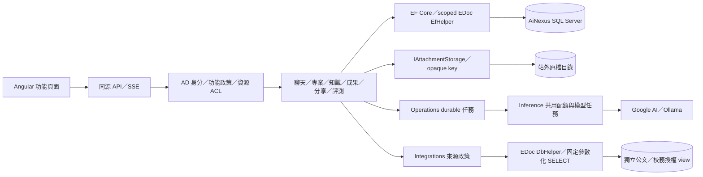

# 架構與擴充邊界

`AiNexus.Features/Monitoring` 在共用 request stream、HttpClientFactory 與 SqlClient 邊界量測，不逐業務方法插入追蹤。Presence 與 15 分鐘聚合均有容量上限；沿用 SSE／權限／稽核，並透過既有 OpenTelemetry 匯出。多執行個體需另外實作分散式 adapter，見 [監控](MONITORING.md)。

診斷入口為 MEL `ILogger`，`AiNexus.Platform/Diagnostics` 集中白名單／遮罩、安全錯誤、W3C Activity、站外 durable JSONL、獨立 SQL 批次補送、管理查詢與清理。安全稽核保持獨立交易政策；OpenTelemetry 1.19.1 匯出可選，預設不用外部 collector。模組不依賴檔案／SQL sink。事件規範、擴充範例與維運限制見 [DIAGNOSTICS](DIAGNOSTICS.md)。

AI Nexus 採 ASP.NET Core 模組化單體與 Angular 功能路由。模組各自管理 endpoint、資料模型與服務，共用 scoped NexusDbContext，讓跨模組異動仍在同一個 transaction 完成。需要獨立部署或強制依賴邊界時才拆 assembly；避免只有轉送用途的 service／repository。

## 模組責任

| 模組           | 責任與邊界                                                                               |
| -------------- | ---------------------------------------------------------------------------------------- |
| Identity       | AD／Windows、SID 映射、cookie／CSRF、帳號偏好；不保存個人密碼                            |
| AccessControl  | 使用者→角色→群組→功能的有效授權及 server-side policy                                     |
| Administration | 一次性管理員 bootstrap、授權、群組模型／配額、管理異動記錄與用量                         |
| Conversations  | 私人訊息樹／分支、標題、收藏／封存／標籤、搜尋與文字備份                                 |
| Inference      | provider、模型呈現政策、Context、聊天排程／SSE、共用模型任務                             |
| Operations     | 健康狀態、活動稽核查詢與寫入、事件清理、durable jobs、租約及 fenced checkpoint            |
| Attachments    | 格式及大小驗證、原始檔／文字、配額、下載授權與保留引用                                   |
| Library        | 個人提示詞範本及容量限制                                                                 |
| Collaboration  | 私有資源、具名 viewer／editor、群組唯讀 ACL、具名到期分享                                |
| Knowledge      | 逐頁閱讀、OCR／索引、獨立 embedding、授權檢索及引用快照                                  |
| Artifacts      | 不可變版本、樂觀衝突檢查、段落工具及 Word／PDF                                           |
| Projects       | 共用指示／文件／範本／成果；提問仍屬個人                                                 |
| Quality        | 私人回饋、固定評測、方案／設定快照、逐題結果及人工評分                                   |
| Integrations   | 來源政策、固定授權 view、唯讀搜尋／歷程、明確匯入與聊天草稿                              |
| Billing        | 追加價格版本、呼叫價格快照、實際用量計費、區間 SQL 彙總與 CSV；不以 Context 預估冒充帳單 |
| WebSearch      | 可控搜尋 provider、本人配額與冪等搜尋紀錄、可核對來源；不爬取結果網站                    |
| Repositories   | 使用者 Gitea token 保護、唯讀 repository／issues／檔案、固定 commit 匯入與來源追溯       |
| Dashboard      | 組合已授權的資源、任務與費用統計；平台範圍另驗 admin，沒有第二套計量邏輯                 |

後端分三個專案，依賴方向固定為 Api → Features → Platform：`AiNexus.Api` 只做 host 組裝與維運指令；`AiNexus.Features` 的每個模組以 `<Module>Module`（`IFeatureModule`）註冊自己的服務、options 驗證、授權政策、rate limit 與端點，`FeatureModules` 是唯一的模組清單，`Persistence` 管共用 context 與 migrations；`AiNexus.Platform` 管錯誤、安全、設定、診斷、HTTP 限制、domain event 分派與原始 EDoc helpers，不引用任何業務模組。端點的 body 上限以 `WithRequestBodyLimit` 宣告在端點旁。`AiNexus.ArchitectureTests` 檢查依賴方向，並以基準線確保跨模組依賴只減不增。slice、錯誤、驗證與授權的寫法見 [後端撰寫慣例](BACKEND_CONVENTIONS.md)。模組間使用明確服務，不新增能繞過 owner、ACL 或模型核准的資料入口。「A 發生後 B 跟著處理」的副作用改用同交易的 domain event（`AiNexus.Platform.Events`）：發布模組 `Raise` 過去式事件，`NexusDbContext.SaveChangesAsync` 在寫入前於同一交易分派給訂閱模組的 handler，一起提交或回復；例如刪除對話／成果撤銷分享、刪除專案解除成果連結。

Notifications 提供 owner scoped durable event 與 typed target，和聊天完成、具名分享、任務 terminal update 使用同一 transaction。RepositoryReviewService 在排程前固定 SHA／diff／模型設定，handler 沿用背景 checkpoint／ModelTaskService，結果讀取仍檢查目前 Gitea 權限；細節見 [通知](NOTIFICATIONS.md)、[程式碼 review](GITEA.md)。

## 三種權限

1. **平台功能**：每次 request 由 SQL 計算有效角色／群組／feature；UI 導覽只是呈現，撤銷影響後續操作。
2. **平台資料**：私人對話驗 owner；專案、知識、成果、評測驗 ResourceAccess。子文件／成果繼承專案 ACL。具名分享另保存快照、收件人及期限。
3. **來源資料**：公文／校務先驗功能及允許來源的群組，再以完整登入者 SID／account 查來源授權 view。平台管理員不自動取得外部資料權限。

擁有者／具名 editor 可寫，群組只授予閱讀。專案成員不因此取得彼此的私人聊天。分享不是匿名 bearer link，也不是原資源的 editor grant。詳見 [授權](ACCESS_CONTROL.md)、[專案](PROJECTS.md)、[分享](SHARING.md)、[整合](INTEGRATIONS.md)。

## 前端共用邊界

| 位置                | 責任                                                                                                               |
| ------------------- | ------------------------------------------------------------------------------------------------------------------ |
| core/api            | OpenAPI 型別、JSON／multipart／SSE transport、CSRF／登入失效／安全錯誤                                             |
| core/auth           | 帳號世代與 WorkspaceSession；功能頁不為導覽載入聊天歷史                                                            |
| core/preferences    | 主題、帳號設定、本機草稿、跨頁新對話草稿交接                                                                       |
| features            | 按路由載入的 UI、feature API 與業務 store；不持續擴大 ChatStore                                                    |
| shared/ui           | Select、ActionMenu、ConfirmDialog、InlineTitle、Markdown、JobProgress；FeaturePage／導覽與資源授權 UI 共用基礎服務 |
| shared/browser      | ViewScope、autosize、拖放／貼圖、下載、複製、文字選取、popover 定位與未儲存提示                                    |
| shared/graphics     | 不含認證／業務依賴的數學，例如傅立葉取樣／DFT                                                                      |
| tokens.scss／styles | 三層 tokens、嵌套主題、分區樣式與統一減少動態規則                                                                  |

頁面使用 Signals、OnPush 與 zoneless。ViewScope 管生命週期與延遲回應的帳號檢查；同頁切換資源還需自己的 request version。離開／換帳號取消訂閱或忽略舊回應。新對話交接只留在記憶體，綁定帳號世代與 conversation ID，讀取一次；不把來源全文放在 URL、history state 或 localStorage。

共享 UI 的 DOM ID 每個實例唯一；浮層使用原生 top layer，避免 dialog／捲動區裁切。管理員元件頁 /design 以正式元件及本機範例檢查主題、鍵盤、停用、確認與有限階段動畫。見 [設計系統](DESIGN_SYSTEM.md)。

`InfoPopover` 統一單次／全對話費用的焦點、Esc 與邊界定位；StorageUsage／RunTimingDisplay 共用容量與耗時呈現；`TrendChart` 使用同一份資料提供 SVG、鍵盤游標與文字表格。Dashboard 的流向圖只呈現真實資源／索引／生成狀態，與後端查詢分離。圖示沿用同一個 Lucide renderer，工作區與快捷指令各有獨立語意。

WorkspaceLayout／WorkspaceSidebar 管所有路由的圖示欄、手機 overlay 與通知入口；NotificationStore 在登入世代切換時清除資料。ConversationActions 共用歷史及工具列操作，MessageContent／AttachmentList／DocumentViewer 共用聊天與唯讀分享呈現。TokenUsageChart 共用日期／模型統計及既有 SVG，不另增圖表依賴。NameDialog 及 TextSourceEditor 保留失敗輸入，服務端仍以 conditional update／concurrency token 防止覆蓋。

## 生成與背景任務

聊天生成驗核准模型、群組配額、owner、思考能力及冪等 key，再於 transaction 保存訊息、run、參數與首個事件。Context 只略過本次送往模型的最舊完整輪次，不刪歷史。worker 每 80ms／512 字元保存部分文字與 replay 事件；SSE 中斷不停止生成，恢復以 GET snapshot／序號進行。編輯新增分支，重新生成新增 assistant sibling。見 [SSE 契約](../contracts/SSE.md)。

文件／索引與評測使用 SQL durable jobs：claim、60 秒租約、2 秒 heartbeat、fenced checkpoint 與已完成項目的重用。停止先記取消要求，離開頁面不取消。外部 RPC 不保證跨程序 exactly-once，未保存結果的呼叫可能在重試時重做。

Google／Ollama adapter 以 keyed DI 註冊，InferenceRouter 依核准 profile 路由並管理每個 provider 容量；聊天佇列按 provider 分開，模型清單探測隔離失敗。排隊 run 保存 provider／原生模型，文字與圖片都從同一路由送出，不自動 fallback。

AttachmentQuota 統一個人／群組／預設容量及 SQL owner lock；AttachmentLifecycle 負責草稿、durable 刪檔 outbox 及孤兒 reconciliation，IAttachmentStorage 負責站外 IO 與串流列舉。DB 不保存原檔 bytes，引用沿用既有 ACL，完整備份需要 SQL＋檔案共同時點。

OCR、段落工具與評測共用 ModelTaskService 的核准、配額及用量；保留配額以使用者 SQL row lock 序列化，RPC 不持有 transaction。評測凍結題庫、指令及模型設定指紋，設定變更阻擋執行／重試，已完成結果保留。來源文字以不可信資料封裝，授權在遠端呼叫前後再檢查。

聊天排程仍在程序內，**每個 IIS app 使用一個 worker**，不開 web garden 或重疊 recycle。GenerationRuns 保存 ExecutorId 與兩分鐘的 LeaseExpiresAt，worker 每 15 秒續約；其他實例只處理已到期的租約，避免 local 與 IIS 共用資料庫時互相中止生成。取消先更新 SQL，原 executor 在續約時偵測並停止。這並未提供全域持久佇列或跨程序的模型容量限制；擴展前仍需補上。首次升級租約版本必須先停止所有舊 host，詳見 [IIS 文件](../deploy/iis/README.md)。

## 費用與外部連線

呼叫以 run／invocation ID 建立唯一 `ModelCharge`，預約時凍結有效價格；串流用量更新與結束狀態使用同一個 BillingService。價格為追加版本，歷史不重算；取消、失敗與 usage 缺失會保留未知費用，不填成零。SQL 報表依幣別與 API／內部成本分組，以參數化日期區間在資料庫彙總；隱藏模型名稱的政策同時套用對話與個人費用報表。詳見 [費用](BILLING.md)。

WebSearch 在送出前才對公開提問查詢，搜尋冪等 key 與配額在 SQL 協調；來源是有限摘要，封裝為不可信資料。Gitea 不使用共用平台 token，每人透過 Data Protection 加密保存自己的 token，保護目的綁定登入者與伺服器 URL。兩種 provider 都限制 HTTP 回應大小、停用重新導向及預設 request logging，避免 credential／query 外洩。

Gitea 的連線／解除與匯入寫入由本機鎖協調，固定 commit 的成功匯入會重用既有文件。此部署要求一個 worker；若擴展為多台並行匯入，需再建立資料庫層的匯入預約與唯一約束。外部呼叫不持有 SQL transaction，也不宣稱能保證外部 exactly-once。

## 資料層與新增功能

EF Core 管 mapping、migration、實體關聯與跨模組 transaction。保留 [EDoc helpers](../backend/src/AiNexus.Platform/Data/EDoc/README.md)，adapter 讓業務寫入共用 scoped context。Dapper 自有連線不自動加入 EF transaction；原生向量寫入明確使用目前 connection／transaction。來源 adapter 只使用固定 SQL 及參數。見 [資料庫](DATABASE.md)。

新增功能建立 module、資料及授權規則、migration、必要的 feature seed、lazy route、共用元件組合，再更新 OpenAPI／型別與實際邊界測試。不是每個操作都要新建授權 feature；工具可沿用所屬功能政策。新增 job 實作 IBackgroundJobHandler，在 RPC 前後驗授權並以 checkpoint 保存結果。

契約工具使用隔離的 TypeScript 5，Angular 使用 TypeScript 6。版本與 lockfiles 一起提交，不手改 generated schema。本機參數、秘密、key ring／進度在 .local，build／報告在 artifacts，整體忽略。日誌只記 ID、狀態與錯誤類別。正式 IIS、效能、來源真實 ACL 與備份還原需在部署環境驗收。
