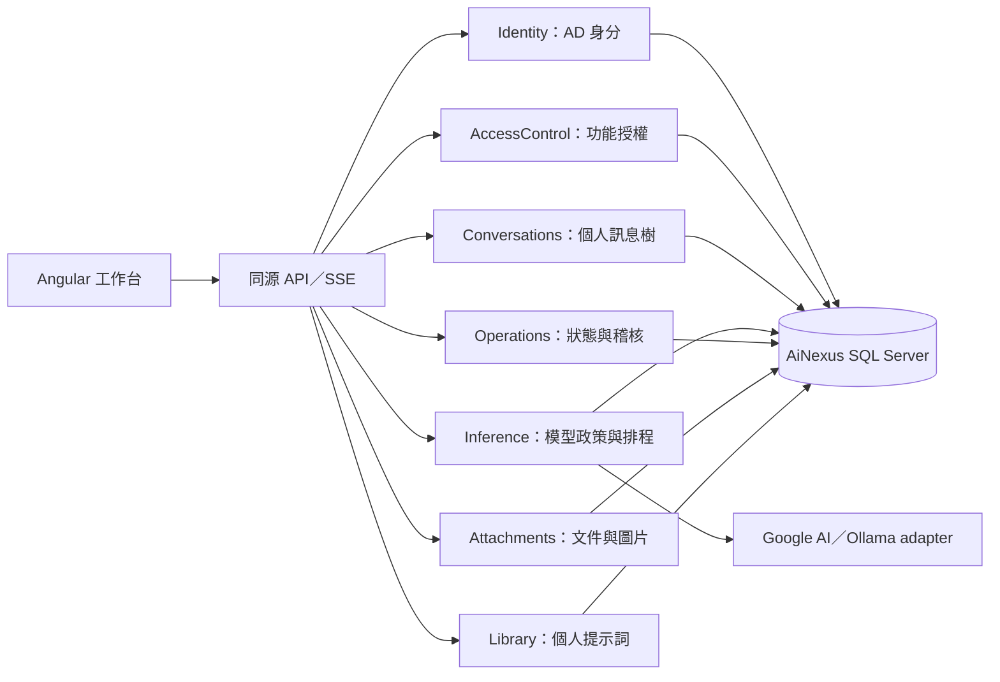

# 架構與擴充邊界

AI Nexus 採單一 ASP.NET Core host 的模組化單體與 Angular 按路由功能載入。第一版保留同一 assembly／scoped context 的 transaction 邊界；需要獨立部署或實際依賴邊界時再拆專案，避免每層只有轉送。

`Attachments` 負責上傳、文件抽取、下載權限與配額；`Library` 管理個人提示詞。`Conversations` 的 Organization service 管理收藏、封存、標籤、複製與文字備份，與生成寫入分開。各模組有自己的 EF configuration，仍透過既有 `IEfHelper<INexusDatabase>` 共用 transaction。

`Collaboration.ResourceAccess` 統一私有資源、具名成員與群組唯讀授權，前端以 `ResourceApi`／`ResourceSharing` 共用操作。`Knowledge` 管逐頁閱讀、切段、embedding、ACL 檢索與引用；`Operations` 提供通用 durable 任務 registry、租約與 fenced checkpoint。生成與 OCR 由 `ModelTaskService` 共用核准模型、日配額及實際用量，remote RPC 不持有資料庫交易。原生向量寫入接在同一 checkpoint transaction 內。

Inference message 支援帶型別的 image parts，供應商的 Google／Ollama 格式只存在 adapter。ContextBuilder 將抽取文字與圖片成本納入同一套預算，生成參數保存當時的對話指令與圖片能力。

## 模組責任

| 模組          | 責任                                                                     |
| ------------- | ------------------------------------------------------------------------ |
| Identity      | AD／Windows 認證、SID 映射、cookie／CSRF、個人偏好                       |
| AccessControl | 角色／群組／功能、有效 grant、FeatureRequirement policy                  |
| Conversations | 擁有者隔離、標題／soft-delete、訊息樹、分支選擇                          |
| Inference     | provider adapter、核准模型／呈現政策、reasoning、Context、run／排程／SSE |
| Operations    | 經驗證的服務狀態、稽核、replay 清理                                      |
| Attachments   | 格式驗證、文件抽取、個人配額、owner 下載、訊息共用關聯                   |
| Library       | 個人提示詞範本 CRUD 與容量限制                                           |

各模組自己的 endpoint 檔案由 BuildingBlocks.ApiEndpoints 組裝。BuildingBlocks 只放共用 DTO／錯誤、host 設定、DB model 與 migrations；Database 放 SqlClient 與 EDoc adapter。模組對模組使用明確服務，不任意新增可繞過 owner／policy 的查詢入口。

Angular 的 features 放 UI 與業務 store；core 管 API／auth／themes／stream；shared/ui 放沒有業務狀態的可重用元件。ChatWorkspace 組合 ChatMessage、ComposerControls、InferenceSignal，設計 token 與樣式分區集中管理。新增功能採 lazy route 與獨立 store；不要把所有業務持續加進 ChatStore。

### 前端共用與功能邊界

| 位置                                   | 責任                                                                                                |
| -------------------------------------- | --------------------------------------------------------------------------------------------------- |
| `core/api/api-transport.ts`            | JSON、multipart、SSE 共用 transport；集中處理 CSRF、安全錯誤與登入失效                              |
| `core/preferences/draft-repository.ts` | 依使用者／對話保存草稿，容量限制與受限儲存回饋                                                      |
| `features/attachments`                 | DraftAttachments 管上傳／還原／移除；AttachmentList 共用於輸入區與歷史                              |
| `features/workspace`                   | WorkspaceApi 管整理、範本與附件契約；操作、指令、範本 dialog 各自封裝                               |
| `features/chat`                        | Workspace 組合 UI；Sidebar 管導覽與偏好；Store 管生成與對話狀態；MessageTree 每份歷史只建立一次索引 |
| `shared/browser`                       | autosize、拖放／貼圖、下載、複製回饋及可取消等待                                                    |
| `shared/ui`                            | 圖示、Markdown、Disclosure、CommandPalette 與生成訊號，不依賴 workspace API                         |

登出／登入失效會清除目前使用者狀態與串流訂閱。回應帶有選取／身分版本檢查，避免晚到的舊結果覆蓋新對話；附件與 SSE 使用 AbortSignal。草稿、圖片能力、Context 與契約使用型別資料，不在 UI 複製 provider 判斷。

## 身分、功能與資料邊界

Ldap 模式用服務帳號查 AD，再以使用者 DN／個人密碼 bind，取得 objectSid 後簽發 HttpOnly／SameSite=Strict cookie；採 StartTLS／LDAPS 信任 OS 憑證，不保存個人密碼。Windows 模式使用 Negotiate／IIS。登入有 CSRF／rate limit，正式 host 不提供測試身分 header。

登入後 `/me` 回傳有效 roles／groups／features。chat endpoints 需要 server-side feature policy；每次 request 查 SQL 讓撤銷立即影響下一次操作。資料仍要驗 owner；對話、父節點、run／cancel／SSE／版本切換統一以 404 回應其他人的資源。寫入需身分綁定的 antiforgery cookie＋header。詳見 [ACCESS_CONTROL](ACCESS_CONTROL.md)。

## 生成的生命週期

1. 驗證核准模型與系統鎖定政策、思考能力、owner、輸入與冪等 key。
2. 保留有界佇列容量，在 transaction 保存訊息、run、參數 JSON 快照、首個事件與 audit；檢查 Context 後提交。
3. 單一 worker 從 SQL 重建該訊息分支與系統指令，依快照呼叫 adapter。每人只能有一個 active run，SQL filtered unique index 與排程 gate 共同保護。
4. 每 80ms／512 字元批次保存部分文字與遞增事件，SSE 訂閱只讀、不控制模型生命週期。
5. 完成／取消／失敗保存最終狀態與 usage，釋放 active owner／佇列容量。停止保留部分回答，重啟會標示殘留工作 `server_restarted`。

編輯建立 user 新分支，重新生成建立 assistant sibling；不覆寫歷史。Context 只裁切本次送給模型的最舊完整輪次，預留輸出 token，不刪 Messages。Context 預覽與實際建構共用演算法，清楚標示保守估算。

Google 原生 SSE 與 Ollama JSONL 只存在各自 adapter。模型核准清單與可用目錄取交集；reasoning 依 profile 能力驗證並傳原生參數。key 在後端 header，adapter 過濾 thought／將 quota 等錯誤轉為安全碼。ModelPresentation 負責所有瀏覽器模型 ID／名稱呈現；隱藏名稱時 SQL 仍保留 provider ID。

斷線以 GET snapshot 與 `after` 序號恢復，不重送生成 POST；POST 回應遺失只以同一 idempotency key 重試。24 小時後重播事件可清理，authoritative run snapshot 仍可恢復。詳見 [SSE 契約](../contracts/SSE.md)。

## 資料層與契約

EF Core migrations 管七個業務 schema；正式禁止 EnsureCreated。ConversationService 重用 EDoc IEfHelper，和其他服務共享 DI scoped NexusDbContext／transaction。Dapper DbHelper 原封保留，透過 SqlClient factory 用於狀態、初始化與特定參數化 SQL；自有連線不自動加入 EF transaction。來源與適配見 [EDoc README](../backend/src/AiNexus.Api/Database/EDoc/README.md)，物件見 [DATABASE](DATABASE.md)。

OpenAPI 產生前端 JSON／SSE 型別；契約工具隔離 TypeScript 5，Angular 使用 TypeScript 6。套件精確版本與 lockfiles 一起保存，升級時更新契約與驗證證據。

## 擴充與執行限制

第一版排程、取消與狀態 gate 在程序記憶體，**只允許一個 host／IIS worker**。禁止 web garden、雙實例與重疊 recycle；分散式或多 GPU 調度要先加入 durable queue、lease／fencing 與跨程序取消，再改部署數量。不可只增加 worker processes。

新增業務功能先建立 Module、Feature grant、前端 feature route、owner／scope policy 及 migration，再加契約／測試。角色管理後台需另有管理 grant 與 audit。更換 provider 時維持 IInferenceProvider 與可序列化參數快照；實際能力由管理設定核准，不在前端猜測。

本機參數／secrets／key ring 與開發紀錄在 `.local`，build／報告在 artifacts，全部不進 Git。日誌只記 ID、狀態與錯誤類別，不記 prompt／回答／provider error body／連線字串。正式保留政策、備份還原、雙帳號隔離與區網效能需實機驗收。
