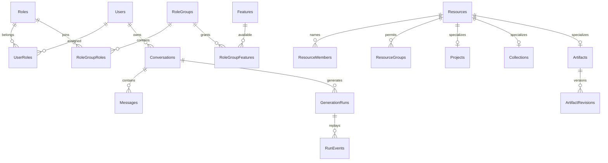

# 資料庫

- 業務資料都在 SQL Server 2025 的 `AiNexus` 資料庫，由單一 `NexusDbContext` 對應；跨模組外鍵與同一交易可直接使用。外部來源（公文、校務）另有唯讀連線，不在這個資料庫。
- **每個模組一個 schema**，名稱＝模組資料夾名小寫。`DatabaseModelTests.SchemaMatchesOwningModule` 強制這條規則；唯一例外是 `Persistence/AuditEvent.cs`（`NexusDbContext` 為所有模組寫入並遮罩稽核紀錄），它的表在 `audit`。
- **說明跟著實體走**：資料表與欄位說明寫在實體類別與屬性上的 `[Comment]`（shadow 屬性用 `HasComment`），EF 會產生 SQL Server 的 `MS_Description`。漏寫會讓 `DatabaseModelTests.EveryTableAndColumnHasDescription` 失敗。索引、約束與 schema 不另寫說明。
- **migration 基線**：2026-10-09 重建為單一 `InitialCreate`（之前的 14 個 migration 已刪除，不保留舊資料庫的升級路徑）。之後的模型變更一律追加具名 migration，不再重置基線。

## Schema 與模組

| Schema | 模組 | Schema | 模組 |
|---|---|---|---|
| `accesscontrol` | AccessControl | `inference` | Inference |
| `administration` | Administration | `integrations` | Integrations |
| `artifacts` | Artifacts | `jobs` | Jobs |
| `attachments` | Attachments | `knowledge` | Knowledge |
| `audit` | Audit | `library` | Library |
| `billing` | Billing | `notifications` | Notifications |
| `collaboration` | Collaboration | `projects` | Projects |
| `conversations` | Conversations | `quality` | Quality |
| `diagnostics` | Diagnostics | `repositories` | Repositories |
| `identity` | Identity | `sharing` | Sharing |
| `websearch` | WebSearch | `dbo` | 只有 `__EFMigrationsHistory` |

各表的欄位、型別與說明以實體及其 `IEntityTypeConfiguration` 為準；兩端分屬不同模組的外鍵集中在 `Persistence/CrossModuleRelationships.cs`。新增模組時 schema 名稱跟著資料夾走，測試會擋下不一致。

## 欄位規則

- 能界定長度的字串一律 `HasMaxLength`，上限最好與 validator 共用常數（例如 `PromptTemplate.ContentMaxLength`）；超過 4000 字元的上限在 SQL Server 會是 `nvarchar(max)`，但上限仍由程式檢查。
- 時間用 `DateTimeOffset`（UTC）；金額 `decimal(20,8)`，未知費用保持 null。
- 原始附件不進資料庫，只保存站外儲存識別與 metadata（見 [附件](ATTACHMENTS.md)）。
- 只有 `Conversation`、`WorkspaceResource` 套用具名 query filter `SoftDelete`；其他刪除是實體刪除。

## 授權關聯



功能 grant 不等於資料 grant：knowledge 不授予全庫閱讀，專案不公開彼此的私人對話。授權模型見 [ACCESS_CONTROL](ACCESS_CONTROL.md)。

## 重要約束與索引（為什麼存在）

- `GenerationRuns`：`OwnerId`＋`IdempotencyKey` 唯一索引防重複送出；`ActiveOwnerId` 非空的 filtered unique index 限制每人一個進行中的生成；`ActiveOwnerId`＋`LeaseExpiresAt` 索引供租約復原。
- `Messages.ParentId` 形成訊息樹，`Conversations.ActiveLeafId` 決定目前分支；編輯與重新生成都新增訊息，不覆寫。
- `ArtifactRevisions` 以 `ArtifactId`＋`Version` 為主鍵；expected version 不符時不覆蓋他人的修改。
- `BackgroundJobs.ActiveKey` 唯一，避免同一業務重複排程；`LeaseToken` 做 fencing，過期 worker 不能提交。
- `EvaluationResults` 以 `RunId`＋`CaseIndex`＋`VariantIndex` 為主鍵，重試時跳過已完成的結果。
- `AuditEvents` 以 `At` 及 `Action`／`ResourceId`／`ActorId`＋`Id` 索引支援日期篩選與遞減游標；`DiagnosticEvents` 以 `At`＋`LogId` 為叢集索引，`LogId` 唯一，補送時去重。
- 重要業務外鍵採 `Restrict`，刪使用者或專案不會連鎖刪除歷史；純附屬資料才 `Cascade`。
- `knowledge.Chunks` 有 `KnowledgeSearch` 全文索引（繁中 1028 斷詞）。`CREATE FULLTEXT` 不能在交易內執行，所以由 `InitialCreate` 末尾的 raw SQL 建立；缺少全文元件或斷詞器時跳過並警示，執行期改用 vector 模式並明確回報。向量表與擴充方式見 [VECTOR_ARCHITECTURE](VECTOR_ARCHITECTURE.md)。

## Migration

```powershell
dotnet ef migrations add DescriptiveChange --project backend/src/AiNexus.Features --startup-project backend/src/AiNexus.Host --output-dir Persistence/Migrations
dotnet ef migrations has-pending-model-changes --project backend/src/AiNexus.Features --startup-project backend/src/AiNexus.Host
```

- 先改實體與組態（含 `[Comment]`），再產生 migration；一起提交 source、designer 與 snapshot。給 DBA 的 idempotent SQL 不進版控，由 `Publish-IIS.ps1` 在發布時產生（套件的 `migrations.sql`），所以不會與程式不同步。不要手改產生的 migration，只有 EF 表達不了的 DDL（例如全文索引）才在產生後加入 `migrationBuilder.Sql`。
- 已設定 SQL 的 host 在 HTTP 與背景 worker 啟動前檢查 migration（`DatabaseSchema`）：有未套用版本或模型與 snapshot 不一致就以退出碼 1 停止並列出版本。`Storage:ApplyMigrationsOnStartup=false`（預設）時只做唯讀檢查，不修改 schema。
- 測試用 SQLite 依目前模型建庫（`SqliteModel.cs` 處理向量與全文差異），不執行 SQL Server migration。

## 初始化與 SQL 權限

```powershell
./scripts/Initialize-Database.ps1
```

- 只在 `AiNexus` 不存在時建庫，然後套用未完成的 migration；不會 DROP、清空資料或修改 history。DBA 也可以先建空的 `AiNexus`，再審閱執行發布套件的 `migrations.sql`（idempotent，依 `__EFMigrationsHistory` 只執行未套用的部分），其中沒有 CREATE LOGIN／DATABASE 或秘密。
- **2026-10-09 以前建立的資料庫無法升級**（舊 migration 已刪除），必須刪除後重新初始化；初始化遇到舊表會直接失敗。
- 正式環境的 DDL 用獨立部署帳號。runtime 登入需要上表所有業務 schema 的 SELECT／INSERT／UPDATE／DELETE 與 `dbo.__EFMigrationsHistory` 的 SELECT，不給建庫、ALTER 或 `db_owner`。目前管理與一般端點共用同一條連線，沒有管理專用的寫入連線。外部來源登入只授權固定 view 的 SELECT（見 [INTEGRATIONS](INTEGRATIONS.md)）。

## 手寫 SQL

EF Core（直接注入 `NexusDbContext`）負責 mapping、migration 與業務寫入。EF 表達不了的 SQL 一律透過 `ISqlDatabase<T>`（`AiNexus.Platform/Data/Sql`，Dapper，只有非同步的查詢與執行）；值用參數，物件名稱只取程式固定清單。

- `ISqlDatabase<NexusDbContext>`：主資料庫。使用 `NexusDbContext` 的連線並加入目前的交易，與同一請求的 EF 寫入一起提交或回復。
- `ISqlDatabase<NexusMasterDatabase>`：只給初始化指令建庫用的 master。
- `ISqlDatabase<LegacyGdwebDatabase>`／`ISqlDatabase<LegacyMeihoDatabase>`：外部來源，每次呼叫自開連線，連線字串強制唯讀意圖與加密；這不取代 SQL 端的 view-only 權限。

新增外部資料庫時，在擁有它的模組加一個實作 `ISqlDatabaseDefinition` 的類別（決定連線字串），再以 `AddSqlDatabase<T>()` 註冊。手寫 SQL 裡的 schema 名稱要與上表一致。

## 真實 SQL Server 測試

向量、全文與交易行為只能在真實 SQL Server 驗證。設定測試 instance（登入須能建立／刪除資料庫與全文 catalog）後執行；每項測試建立並清理自己的 `AINexus_Retrieval_Test_` 資料庫，未設定時明確略過。

```powershell
$env:AINEXUS_SQLSERVER_TEST = 'Server=localhost;Integrated Security=true;Encrypt=true;TrustServerCertificate=true'
dotnet test --project backend/tests/AiNexus.Tests --filter "FullyQualifiedName~SqlServerRetrievalTests"
```

## 保存與備份

- `RunEvents` 預設保留 24 小時供 SSE 重播，權威狀態在 `GenerationRuns`；未被引用的草稿附件依保留期清理；分享到期後清理快照。
- 軟刪除的對話、成果，以及稽核、評測資料的保存期由部署單位制定，目前沒有自動硬刪。
- 完整備份＝同一時點的 SQL＋站外附件目錄＋設定與 Data Protection key ring，步驟見 [BACKUP](BACKUP.md)。
