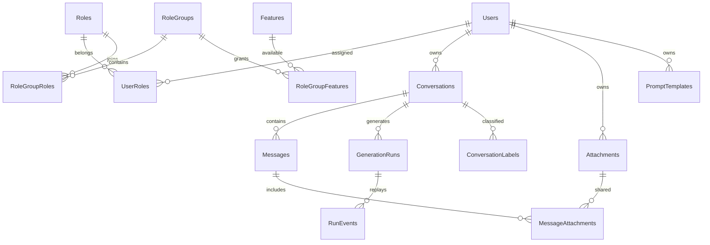

# 資料庫與 schema

所有業務資料存於同一個 **AiNexus** SQL Server database。`schema` 是資料庫內的命名空間，例如 `[access].[Roles]`；不是另一個資料庫或獨立連線。依模組分 schema，讓物件責任、migration 與權限授予清楚，也避免未來功能都擠在 dbo。跨 schema 的外鍵與同一個 EF transaction 仍可使用。

`KnowledgeAndJobs` migration 增加 collaboration／knowledge schema，並補上以下物件。原先七個 schema 仍保留；content schema 保存成果文件版本。

| 物件                                               | 責任                                                      |
| -------------------------------------------------- | --------------------------------------------------------- |
| `collaboration.Resources`                          | 共用資源名稱、類別、擁有者、soft-delete 與更新時間        |
| `collaboration.ResourceMembers` / `ResourceGroups` | 具名閱讀／編輯與群組唯讀 grant；擁有者權限隱含            |
| `attachments.ResourceAttachments`                  | 文件／專案保留原檔引用，與訊息引用共同決定清理            |
| `knowledge.Collections` / `Documents`              | 知識庫說明、原檔來源、處理狀態、頁數、索引 profile        |
| `knowledge.DocumentPages`                          | 逐頁文字、native／OCR 標記與核對提示                      |
| `knowledge.Chunks`                                 | 切段文字、頁碼、768 維 JSON；SQL 2025 額外有原生 VECTOR   |
| `knowledge.ConversationCollections`                | 每段對話使用的知識庫，最多三個                            |
| `knowledge.MessageCitations`                       | 回答當時的來源識別、頁碼、標題與摘要快照                  |
| `operations.BackgroundJobs`                        | 租約、checkpoint、取消要求、嘗試次數與安全錯誤            |
| `inference.ModelInvocations`                       | OCR／文字任務及 embedding 的實際用量與狀態；不保存 prompt |

首次登入仍取得 member；workspace 群組增加 knowledge／tasks 功能。撤銷仍按 SQL 的有效角色、群組及功能判斷，不重新授予被撤銷角色。詳見 [知識庫](KNOWLEDGE.md)。

## 物件清單

`PersonalSettings` migration 擴充 `identity.UserPreferences`，保存閱讀字級、行距、密度、內容與側欄寬度、Enter 送出、自動跟隨、草稿保存、完成通知與思考強度。預設值保留既有閱讀與操作習慣；設定以 UserId 的 1:1 關聯隔離，AD 密碼與 API key 不會放在個人偏好中。

`Administration` migration 新增 `access.AdministratorBootstraps`（一次性授權標記）、`access.GroupModelPolicies`（群組模型清單、日配額、附件上限），以及管理角色、群組與 `admin` 功能。`operations.AuditEvents.DetailsJson` 記錄授權識別碼和限制，與主異動同一 transaction 提交。管理規則見 [ADMINISTRATION](ADMINISTRATION.md)。

`WorkspaceExtensions` migration 新增以下物件，保留既有使用者與對話資料。共有 identity、access、conversations、inference、operations、attachments、library 七個業務 schema。

| 新增物件／欄位                                              | 用途與規則                                                           |
| ----------------------------------------------------------- | -------------------------------------------------------------------- |
| `attachments.Attachments`                                   | owner、原始 SQL binary、MIME、大小、抽取文字與建立時間               |
| `attachments.MessageAttachments`                            | MessageId + AttachmentId 複合主鍵；讓分支及副本共用附件              |
| `library.PromptTemplates`                                   | 個人提示詞範本；owner 索引，每人最多 100 個                          |
| `conversations.ConversationLabels`                          | ConversationId + Name 複合主鍵，每段對話最多 5 個                    |
| `Conversations.IsFavorite / IsArchived / SystemInstruction` | 收藏、可還原封存、對話專屬指令；新增 owner + 整理狀態 + 更新時間索引 |
| `Messages.ErrorCode`                                        | 保存失敗原因，重新開啟仍能顯示正確回饋                               |

標題與訊息內容搜尋使用 owner 限制下的 SQL substring 查詢。目前不依賴 SQL Server Full-Text Catalog；資料量增大時可保留 API 契約，改用全文索引或搜尋服務。

| Schema／物件                  | 用途與關鍵規則                                                                                          |
| ----------------------------- | ------------------------------------------------------------------------------------------------------- |
| `identity.Users`              | 平台身分；以 AD SID 唯一索引映射，保存帳號、顯示名稱、建立／最近登入時間，不存個人密碼                  |
| `identity.UserPreferences`    | Users 的 1:1 owned entity；外觀、減少動態、偏好模型                                                     |
| `access.Roles`                | 角色主檔；穩定文字 ID、名稱、Enabled                                                                    |
| `access.RoleGroups`           | 多個角色可加入的功能集合，Enabled 可一次停用該群組                                                      |
| `access.Features`             | 功能主檔，包含 ID、名稱、前端 route、排序、Enabled                                                      |
| `access.UserRoles`            | 使用者與角色多對多；複合 PK `UserId+RoleId`                                                             |
| `access.RoleGroupRoles`       | 角色與群組多對多；複合 PK `RoleId+GroupId`                                                              |
| `access.RoleGroupFeatures`    | 群組與功能多對多；複合 PK `GroupId+FeatureId`                                                           |
| `conversations.Conversations` | 擁有者、標題、目前 leaf、時間、soft-delete；擁有者／刪除狀態／時間索引                                  |
| `conversations.Messages`      | 不可覆寫的訊息樹，ParentId 外鍵；user／assistant、內容、模型、狀態、run ID                              |
| `inference.GenerationRuns`    | 一次生成；擁有者、訊息關聯、參數 JSON 快照、冪等 key／hash、狀態、部分回答、時間、實際 usage            |
| `inference.RunEvents`         | `RunId+Sequence` 複合 PK 的重播事件；24 小時後清理，快照仍可恢復                                        |
| `inference.ModelProfiles`     | SQL 可保存的模型能力記錄；目前執行核准清單由設定檔管理，worker 啟動同步能力，思考／呈現政策仍由設定管理 |
| `operations.AuditEvents`      | 必要操作追蹤，保存 resource／owner ID、動作、結果、時間，不存 prompt／回答／密碼                        |
| `dbo.__EFMigrationsHistory`   | EF 已套用版本，不能手改或以刪除此表重跑 migrations                                                      |

`GenerationRuns` 唯一索引 `OwnerId+IdempotencyKey` 防重複送出；`ActiveOwnerId IS NOT NULL` 的 filtered unique index 保護每人一個 active run。完成／取消／失敗清除 ActiveOwnerId。重要業務外鍵採 Restrict，防止刪使用者／對話造成歷史連鎖刪除；run events 屬生成的附屬資料。

## 授權關聯



預設 `member`（一般使用者）→ `workspace`（基本工作台）→ `chat`、`knowledge`、`tasks`。AccessControl migration 補上既有使用者的 member；首次登入的新使用者在同一 transaction 建立角色關聯。既有使用者登入不重新授予被管理員撤銷的角色，細節見 [ACCESS_CONTROL](ACCESS_CONTROL.md)。

## 訊息、分支與 Context

Messages.ParentId 形成訊息樹，Conversations.ActiveLeafId 決定目前閱讀的路徑。編輯建立新 user 節點，重新生成建立新的 assistant sibling，原資料保留。切換分支只更新 leaf。取消或失敗保留已保存的部分回答；UI 刪除對話採 soft-delete。

ContextBuilder 重建目前路徑，加入系統指令並預留輸出；超量只裁切本次送給模型的上文，不刪 SQL 歷史。`POST /api/v1/context` 使用相同預算演算法，在送出前回傳估計數字。已完成的 provider usage 存於 GenerationRuns；Gemma 的 hidden thought 不呈現於回答。

## EDoc／EF Core／Dapper 分工

重用 [EDoc helpers](../backend/src/AiNexus.Api/Database/EDoc/README.md)。DbHelper 與相關封裝保存來源原始內容；EfHelper 使用 AI Nexus 的 scoped context 適配，讓 ConversationService、RunService 與 CurrentUser 共享同一個交易。

EF Core 管理 mapping、migrations、實體關聯與聊天寫入。Dapper DbHelper 用於參數化 SQL、狀態檢查與 master 建庫。`NexusConnectionFactory` 把 `INexusDatabase` 對應 AiNexus，把 CLI 專用 `INexusBootstrapDatabase` 對應 master。原 EDoc 專案不需要一起 build 或部署。

Dapper 預設建立自己的連線，不能假設它參與 EF transaction；需要同一 transaction 時使用對應 helper 的交易 API 或明確傳入同一 connection／transaction。禁止拼接使用者字串為 SQL；值使用 parameters，物件名稱只使用程式固定清單。

## 建立與更新

```powershell
./scripts/Initialize-Database.ps1
```

本機工具僅建立／更新 AiNexus，不刪除資料。版本由 EF 控制：`InitialNexus` 建立聊天結構，`AccessControl` 新增授權與預設 seed／既有使用者 backfill，`WorkspaceExtensions` 加入附件、範本與對話整理。原始碼在 `BuildingBlocks/Migrations`，重跑只套用未完成版本。

DBA 可先建立 AiNexus，再審閱執行 [db/migrations.sql](../db/migrations.sql)；這份 EF 產生的 idempotent SQL 包含全部版本，需要在 AiNexus database 中執行。腳本不包含 CREATE LOGIN、CREATE DATABASE 或秘密。正式應用預設不啟動 migration，應由獨立部署帳號執行 DDL。EF 指引：[Applying migrations](https://learn.microsoft.com/en-us/ef/core/managing-schemas/migrations/applying)。

正式帳號至少需要 identity、conversations、inference、operations、attachments、library、collaboration、knowledge、content schema 的 SELECT／INSERT／UPDATE／DELETE，以及 access schema SELECT／INSERT（首次登入寫 UserRoles）。更細的 access 權限可分為主檔 SELECT 與 UserRoles SELECT／INSERT；授權管理使用另一個受控管理登入。不可讓一般 UI 直接寫 Roles／Features，也不給應用登入 master 建庫與 ALTER schema 權限。

## 備份與資料生命週期

RunEvents 預設 24 小時回播保留，conversation soft-delete 沒有自動永久清除；對話、soft-delete 與 audit 的保存期由部署單位決定，再加入明確的 retention 工作。SQL 備份需保護 ACL 與加密，key ring 另備份；在獨立資料庫實際還原，確認 SID、角色、訊息樹、重啟恢復與跨帳號隔離。不能只以產生 bak 檔判定成功。正式 recovery model 與完整／差異／log 備份排程由 DBA 設定，參考 [SQL Server 備份還原](https://learn.microsoft.com/en-us/sql/relational-databases/backup-restore/back-up-and-restore-of-sql-server-databases?view=sql-server-ver17)。

成果文件的 content.Artifacts 與 content.ArtifactRevisions 關聯及版本策略，見 [ARTIFACTS](ARTIFACTS.md)。

Projects migration 新增 projects.Projects／ProjectTemplates，並以 Resources.ParentId、Conversations.ProjectId 與 Artifacts.ProjectId 建立工作區關聯。專案子項目以同一套 ACL 繼承一層授權。

