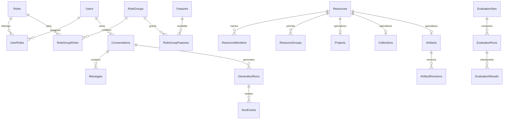

# 資料庫與 schema

業務資料集中在 **AiNexus** SQL Server database。schema 是資料庫內的命名空間，例如 `[access].[Roles]`，不是另一個 database 或另一條連線。按模組分 schema，讓責任、migration 與 SQL 授權容易辨識；跨 schema 外鍵及同一個 EF transaction 仍可使用。

已有 SQL 登入可直接使用，不必另建同名帳號。一般參數在 .local/config/appsettings.Local.json，密碼在 .local/secrets/appsettings.Secrets.json。Initialize-Database.ps1 用既有登入建立不存在的 AiNexus，再套用未完成版本；無建庫／DDL 權限時由 DBA 先建庫及套用 SQL。見 [參數](CONFIGURATION.md)。

## Schema 與主要物件

| Schema        | 主要物件                                                                  | 責任                                                        |
| ------------- | ------------------------------------------------------------------------- | ----------------------------------------------------------- |
| identity      | Users、UserPreferences                                                    | AD SID、帳號與個人偏好，不保存個人 AD 密碼                  |
| access        | Roles、RoleGroups、Features、UserRoles、RoleGroupRoles、RoleGroupFeatures | 使用者→角色→群組→功能、Enabled／有效授權                    |
| access        | AdministratorBootstraps、GroupModelPolicies                               | 一次性 bootstrap、模型清單／日配額／儲存限制                |
| conversations | Conversations、Messages、ConversationLabels                               | 私人訊息樹、目前分支、指令、收藏／封存／標籤                |
| inference     | GenerationRuns、RunEvents、ModelProfiles、ModelInvocations                | 執行參數／冪等、SSE replay、能力、OCR／文字／embedding 用量 |
| operations    | AuditEvents、BackgroundJobs                                               | 同交易稽核、durable 租約／checkpoint／取消／重試            |
| attachments   | Attachments、MessageAttachments、ResourceAttachments                      | 原始檔、文字、訊息及資源引用／保留與配額                    |
| library       | PromptTemplates                                                           | 個人提示詞，最多 100 個                                     |
| collaboration | Resources、ResourceMembers、ResourceGroups                                | 擁有者、具名 viewer／editor、群組唯讀、ParentId 繼承        |
| collaboration | ShareLinks、ShareRecipients                                               | 到期／撤銷、具名收件人、版本快照及明確附件授權              |
| knowledge     | Collections、Documents、DocumentPages、Chunks                             | 頁面、OCR 狀態、索引 profile、片段／向量                    |
| knowledge     | ConversationCollections、MessageCitations                                 | 對話選定來源及回答當時的文件／頁碼／摘要                    |
| content       | Artifacts、ArtifactRevisions、SourceReferences                            | 成果不可變版本、目前版本、來源識別／版本／時間              |
| projects      | Projects、ProjectTemplates                                                | 共用指示、專案版本及範本，文件／成果透過 Resources 關聯     |
| quality       | MessageFeedback、EvaluationSets、EvaluationRuns、EvaluationResults        | 私人回饋、固定題庫、執行設定及逐題結果／人工評分            |
| dbo           | \_\_EFMigrationsHistory                                                   | 已套用的 EF 版本，不可手改或刪除以重跑 migration            |

共有 12 個業務 schema，由 source migrations 管理。原始附件存於 SQL binary，不在 wwwroot。個人偏好為 UserId 的 1:1 關聯，包含外觀、閱讀、對話操作及通知；API key／SQL／AD 服務密碼不在偏好表。

## 授權關聯



首次登入在同一 transaction 建立 Users 與 member。本版完整 migrations 後，member→workspace 提供 chat、projects、knowledge、artifacts、shared、quality、tasks；admin／integrations 預設只授予 administrators。既有帳號登入不重新授予被撤銷角色。個人設定依登入帳號可用，不另建秘密表。bootstrap 完成一次即留下標記，防止撤銷後又因登入取得管理權。

**功能 grant 不等於資料 grant**：knowledge 不授予全庫閱讀，專案不公開彼此私人聊天。Resources.ParentId 提供一層專案繼承，具名 editor 可寫、群組唯讀。ShareRecipients 與原資源 ACL 分開。外部來源還需完整 SID／account 授權。

## 歷史與重要索引

- Messages.ParentId 形成訊息樹，Conversations.ActiveLeafId 決定目前路徑。編輯新增 user，重新生成新增 assistant sibling，停止／失敗保存部分回答。
- GenerationRuns 的 OwnerId＋IdempotencyKey 唯一索引防重複送出；ActiveOwnerId 非空的 filtered unique index 限制每人一個 active run。
- `20261004151226_GenerationExecutorLeases` 新增 ExecutorId、LeaseExpiresAt 與 ActiveOwnerId＋LeaseExpiresAt 索引。租約每 15 秒續約，兩分鐘未續約才判定 executor 中斷；保留部分回答與歷史事件，停止重複處理。升級需先停止所有舊 host，以免舊版 recovery 繼續誤判其他實例。
- ArtifactRevisions 的 ArtifactId＋Version 複合主鍵保存版本；expected version 衝突不覆蓋他人的異動。
- BackgroundJobs 保存 ActiveKey、LeaseToken／期限、階段／完成量及 attempt；checkpoint 經 fencing，過期 worker 不能提交。
- EvaluationResults 的 RunId＋CaseIndex＋VariantIndex 複合主鍵支援重試跳過已完成結果。VariantsJson 保存模型設定及指紋，不含 key／密碼。
- ShareLinks 按擁有者／期限索引；撤銷、到期及原始刪除停止閱讀，清理快照與附件引用。
- AuditEvents 以 At、Action＋Id、ResourceId＋Id 索引支援日期篩選與遞減游標；`20261004112414_AdministrativeInspectionAudit` migration 新增後兩個索引。DetailsJson 保存管理異動的前後狀態或唯讀檢視範圍，不保存密碼、API key、搜尋文字或對話內容。
- 重要業務外鍵採 Restrict，避免刪使用者／專案造成歷史連鎖刪除；純附屬資料依明確策略處理。

搜尋目前以 owner 限制下的 SQL substring 查詢，未建立 Full-Text Catalog；資料量增大可保留 API 再加全文搜尋。Context 只裁切此次提供模型的上文，不刪歷史，預估與實測 tokens 分開保存。

UsageReports 共用 GenerationRuns／ModelInvocations 的 SQL 聚合查詢，提供平台、各使用者與個人設定的用量；使用者清單批次取得用量，避免逐人查詢。管理員可透過獨立且受稽核的唯讀 endpoint 檢視使用者的所有對話版本（包含封存及選擇顯示的已刪除對話），一般對話 API 仍維持擁有者隔離。

## 向量與外部來源

knowledge.Chunks.EmbeddingJson 保存正規化 768 維向量及 profile。SQL Server 2025 額外有 EmbeddingVector VECTOR(768)，寫入與 checkpoint 共用 EF transaction；欄位由條件式 migration 建立，不以 EF 直接映射 VECTOR。檢索先限定授權知識庫、ready 文件及相同 profile，再排序精確 cosine，不自動開 ANN preview。見 [向量設計及公文／校務建議](VECTOR_ARCHITECTURE.md)。

content.SourceReferences 保存明確匯入的個人成果之 SourceId／ExternalId／Revision／ImportedAt。公文／校務仍為獨立來源庫，透過 nexus.AuthorizedRecords／AuthorizedRecordHistory view 與來源專用唯讀登入，以完整 SID／account 取得資料。來源版本變更要求重新讀取；已明確保存的個人副本不因來源撤權自動遠端抹除。AiNexus migration 不在外部庫建物件，DBA 範本在 db/integrations。見 [來源契約](INTEGRATIONS.md)。

## EDoc、初始化及 SQL 權限

保留 [EDoc 原始 helper](../backend/src/AiNexus.Api/Database/EDoc/README.md)。EF Core／IEfHelper 管 mapping、migration、業務寫入及共用 scoped context。Dapper IDbHelper 用於固定參數化 SELECT、狀態及建庫；自有連線不自動參與 EF transaction。值用 parameters，物件名稱只取程式固定清單。

NexusConnectionFactory 以 marker 對應 AiNexus、CLI 專用 master，以及 LegacyGdweb／LegacyMeiho。來源連線加密及唯讀意圖不取代 SQL 的 view-only 權限。

```powershell
./scripts/Initialize-Database.ps1
```

工具不刪資料，重跑只套用未完成版本。DBA 可先建 AiNexus，再在此資料庫執行 [idempotent SQL](../db/migrations.sql)；腳本不含 CREATE LOGIN／DATABASE 或秘密。版本 source 在 backend/src/AiNexus.Api/BuildingBlocks/Migrations。正式 DDL 使用獨立部署帳號，不開應用啟動 migration。

本版管理與一般 endpoint 共用 Nexus 連線，runtime 登入需要上述 12 個業務 schema 的 SELECT／INSERT／UPDATE／DELETE，也包括 bootstrap／管理異動的 access 物件；實際操作由後端政策控制。**目前沒有管理專用寫入連線**，不能只給 access SELECT／首次登入 INSERT 就預期後台可運作。runtime 不給 master 建庫、ALTER schema 或 db_owner；進一步分離管理 SQL 權限需要實作獨立連線及交易邊界。外部來源登入則只授兩個固定授權 view 的 SELECT。

## 保存與備份

RunEvents 預設保留 24 小時 replay，權威 run 快照仍可恢復；未被訊息／資源／分享引用的附件依保留期清理。分享到期可清理快照，soft-delete 對話、成果、audit 與評測等保存期由部署單位制定，再加入明確 retention。

完整備份包含全部 schema 與原始附件，JSON 文字備份不含附件。Data Protection key ring 另備份。應在獨立資料庫實際還原，核對 SID、角色、ACL、訊息樹、版本、索引 profile 及跨帳號隔離；不能只以產生 bak 檔判定完成。recovery model 與完整／差異／log 排程由 DBA 設定。
