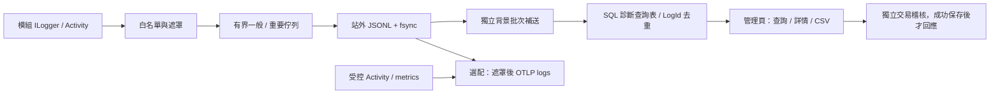

# 系統日誌、查證代碼與維運

此功能可在既有 .NET 10／Angular 22、Windows IIS 與 SQL Server 環境運作。診斷資料存入站外 JSONL，背景批次匯入 `operations.DiagnosticEvents`；管理員使用 `/admin/logs` 查詢。安全稽核仍在 `operations.AuditEvents`，採獨立權限與保存政策。本文件中的主機指令是部署人員的操作指南；repository 驗證沒有操作正式 IIS、升級 SQL Server 或部署。

## 架構與技術選擇

業務模組只使用 `Microsoft.Extensions.Logging.ILogger`、結構化 message template、`Activity` 與既有稽核服務。`BuildingBlocks/Diagnostics` 集中處理欄位白名單、遮罩、查證代碼、例外分類、佇列、檔案、SQL、查詢與清理，不讓模組依賴儲存目的地。

使用既有 .NET 10 logging API 和 OpenTelemetry .NET **1.19.1**，套件版本與 lockfiles 一起維護。Serilog 是可用的成熟選擇，但一般 rolling file sink 並不包含本案所需的 SQL 補送 checkpoint、多執行個體協調和特權讀取稽核。因此採一個 MEL provider、一份同時作為輪替日誌及 durable replay journal 的檔案，避免兩套不同保存結果；沒有為選配匯出引入第二個未遮罩的 application logger。這不是通用可任意序列化的 logging sink；邊界只接受受控 metadata。

參考：[ASP.NET Core logging](https://learn.microsoft.com/en-us/aspnet/core/fundamentals/logging/?view=aspnetcore-10.0)、[OpenTelemetry .NET exporters](https://opentelemetry.io/docs/languages/dotnet/exporters/)、[Serilog file sink](https://github.com/serilog/serilog-sinks-file)。



日誌寫入不加入業務 transaction。SQL 使用新連線、`Enlist=false`、抑制 ambient transaction、有限逾時、`SqlBulkCopy` 暫存表與獨立 commit。匯入成功後才更新 atomic byte cursor；若 commit 成功後程序退出而 cursor 未更新，重送以 LogId 去重。檔案 writer 與 SQL importer 各有背景迴圈，SQL 故障不會阻塞檔案保存。

## 事件與等級

每筆事件都有隨機唯一 LogId、UTC `At`、Level、Category、EventId／EventName、MessageTemplate、PropertiesJson、Service、Environment、Version、Instance。IssueCode、TraceId／SpanId、RequestId、OperationId、JobId、RunId、Attempt、UserId、Method、Route、StatusCode、DurationMs、ExternalService、ErrorCode、ExceptionType／ExceptionDetail 依事件加入。Instance 包含主機、process ID 與每次啟動的隨機識別。

| 等級 | 使用情境與政策 |
| --- | --- |
| Trace | 開發／短期深度追查；仍受遮罩及大小限制 |
| Debug | 演算法與狀態診斷，不記查詢、聊天或文件文字 |
| Information | 正常操作、request 完成、背景工作生命週期、預期拒絕及使用者取消 |
| Warning | 降級、重試、部分功能不可用、受控不可信前端回報 |
| Error | 作業、生成、API 內部操作失敗；不可被一般採樣略過 |
| Critical | 啟動失敗或重大服務失效；不可被一般採樣略過 |

有查證代碼的驗證／授權拒絕也不被採樣，核心 `http.rejected` 不受最低等級過濾。一般驗證不是 Error；使用者取消不是系統故障。安全稽核完全不經診斷採樣佇列。

| EventId | EventName |
| --- | --- |
| 1000 / 1001 / 1002 | `http.completed` / `operation.failed` / `http.rejected` |
| 2001 / 2002 | `retrieval.degraded` / `retrieval.retry` |
| 3000 / 3001 | `job.started` / `job.finished` |
| 3100 / 3101 | `generation.started` / `generation.finished` |
| 4001 | `client.unhandled` |
| 5000 / 5001 / 5002 | `service.started` / `service.stopping` / `service.startup.failed` |

新增業務事件使用固定 EventId／EventName。既有無 EventId 的 ILogger 呼叫以 Category＋固定模板的 SHA-256 產生穩定整數 ID；它不是不可碰撞的業務識別，追查時同時使用 Category／EventName。修改模板會改變 fallback ID，因此新功能應明確定義事件。若同一例外跨層拋出，`Issues.Report` 在例外 Data 記錄已分配代碼，避免再次保存同一問題；呼叫端不應先記 Error 再重新拋出讓最外層重複記錄。

| 欄位 | 上限 |
| --- | --- |
| Category / EventName / Service / Environment / Version / Instance | 180 / 100 / 80 / 32 / 80 / 100 字元 |
| MessageTemplate / PropertiesJson | 2,048 / 8,192 字元 |
| TraceId / SpanId / RequestId / Method / Route | 32 / 16 / 40 / 10 / 240 字元 |
| ErrorCode / ExternalService / ExceptionType / ExceptionDetail | 80 / 32 / 180 / 12,000 字元 |
| 結構化屬性 | 最多 32 個受核準 scalar；字串每值 240 字元 |
| journal envelope | UTF-8 每筆最多 65,536 bytes，包含 checksum |

允許的 metadata 名稱見 `DiagnosticRedactor.Fields`。只接受 ID、有限數值、布林、受控 enum 和核準字串；任意物件替換為 `[OBJECT OMITTED]`，不呼叫其 `ToString()` 或 serializer。截斷在 regex 前開始，限制最差輸入成本；補送時再次套用白名單、字元與 UTF-8 上限。

## 訊息呈現與請求上下文

儲存仍採 MessageTemplate＋受控 PropertiesJson，沒有重複儲存一份展開文字。API 的 Message 在讀取時由共用 DiagnosticMessage 產生；舊 HTTP 模板同樣能帶入 StatusCode／DurationMs。列表只能代入摘要權限已有的欄位，其他參數顯示 [omitted]；特權明細與受控 OTLP 日誌可代入遮罩後的白名單屬性。原模板在明細「受控屬性」分頁保留，可複製。此流程不呼叫原始 ILogger formatter，避免將未核准物件或任意內容帶回日誌。

HTTP scope 補充 ClientAddress、UserAgent、RequestProtocol、RequestScheme；完成事件補充 RequestOutcome、RequestAborted、ResponseStarted。耗時只量測一次並保留至毫秒的小數三位。取消請求合併在完成事件，避免重複記錄。成功的 /admin/logs 查詢、詳情、健康與匯出已有不可省略的稽核紀錄，因此不再寫入相同 HTTP 完成事件；錯誤與取消仍保留。

ClientAddress 只取 host 解析的 Connection.RemoteIpAddress，IPv4-mapped IPv6 會正規化。診斷 middleware 不自行信任 X-Forwarded-For；有反向代理時由部署端設定受信任的代理／網段，否則記錄的可能是代理 IP。User-Agent 是不可信的用戶端提示，限制 240 字元並遮罩；不蒐集完整 header、Cookie、Authorization、完整 URL、query、body、DOM 或瀏覽器指紋。這些資訊只放在 logs.detail 的受控屬性，與既有保存期限及 OTLP 政策共用；歷史日誌不會自動補回未蒐集的資料。

設計依據：[OpenTelemetry HTTP 語意](https://opentelemetry.io/docs/specs/semconv/http/http-spans/)與 [ASP.NET Core 代理信任設定](https://learn.microsoft.com/en-us/aspnet/core/host-and-deploy/proxy-load-balancer?view=aspnetcore-10.0)。HTTP 狀態、typed error code、例外型別／方法堆疊、RequestId／TraceId／JobId／RunId、重試次數與版本仍是主要診斷依據；IP 與 User-Agent 是補充線索，不能取代錯誤分類與流程關聯。

## 安全錯誤契約與流程關聯

一般 API 回傳 `application/problem+json`，例如：

```json
{
  "type": "urn:ai-nexus:problem:service_unavailable",
  "title": "操作未完成，請聯絡管理員。查證代碼：NX-0123456789ABCDEF0123456789ABCDEF",
  "status": 503,
  "code": "service_unavailable",
  "issueCode": "NX-0123456789ABCDEF0123456789ABCDEF"
}
```

上例的代碼只是格式說明。實際代碼由伺服器 CSPRNG 產生 128-bit 隨機值，`NX-`＋32 個十六進位字元；不是權限憑證。一般使用者不能用它查詢管理 API。安全的 4xx 格式、驗證與操作提示來自固定 `PublicErrorCatalog`，保留公開 Code、狀態碼與重試分類，不使用 ApiException.Message 作為回應。

Angular `ApiError` 不信任伺服器的任意 title／message，而按固定公開 catalog 和有效 IssueCode 顯示提示；頁面、toast、附件／工作詳情、通知與聊天失敗共用相同政策，提供複製按鈕。本機格式／容量檢查使用受限 `ClientValidationError` 的固定提示；預期 AbortError 取消不當成未處理故障回報。未取得有效伺服器代碼時使用 `LOCAL-`＋16 個十六進位字元，明確顯示「尚未記入伺服器」。舊歷史失敗沒有新代碼時也不顯示原始 ErrorMessage；新日誌無法倒推已發生的舊例外。

HTTP middleware 為每個 request 建立自己的 W3C server Activity、RequestId 與 OperationId；不繼承外部 `traceparent`、查證代碼、request ID 或前端聲稱的 UserId。UserId 只來自已驗證且伺服器解析的使用者，診斷不保存 account／email。Activity 的 route tag 只用路由模板，沒有完整 URL 或 query。若上游需要跨服務 trace，需另外設計受信任入口政策；本版預設不信任公開用戶端關聯。

Job／Run 在入列時保存 TraceId、ParentSpanId、OperationId。worker 建立新的 Consumer Activity，放入 JobId／RunId、核準使用者、Attempt，清除 RequestId 的 request scope；結束時 Dispose Activity。相同 job 重試和重啟後維持流程 TraceId／JobId，Attempt／SpanId 不同，每次獨立失敗有不同 IssueCode。長流程中的多個問題因此不共用一個模糊查證代碼。舊 active job 在 claim 時以 fenced 更新補上關聯；逾期 generation executor 回收也保存安全失敗與新查證代碼。

SSE 已開始時送出安全的 `event: error`：

```text
event: error
data: {"code":"service_unavailable","message":"操作未完成，請聯絡管理員。查證代碼：NX-…","issueCode":"NX-…"}

```

durable run `status`／`snapshot` 事件同樣有 issueCode。不得將例外文字塞入 stream。已開始的非 SSE 二進位／附件／匯出回應發生失敗會中止連線；HTTP 狀態已開始後不能改寫，管理員用關聯日誌追查，前端可能只能顯示明確的本機連線問題代碼。

前端 ErrorHandler 捕捉未處理 exception 與 Promise rejection，經已登入、CSRF 保護的 `/api/v1/client-issues` 回報：只送 `kind` 和粗粒度 SHA-256 fingerprint，不送 message、stack、URL、DOM 或資料內容。伺服器 body ≤2 KiB、每人 10 次／分鐘、10,000 個去重 cache entry／TTL 1 分鐘；前端每分鐘最多 5 次、最多 32 個近期 fingerprint。標記 `UntrustedClient=true`，不能當成真實伺服器例外。`accepted=true` 只表示有界佇列接受，並非同步落盤保證；離線、回報失敗或拒絕入列時維持 LOCAL 代碼。

## 遮罩與注入防護

預設不記密碼、Cookie、Authorization、API key／token、連線字串、完整 request body／query、聊天與文件內容、OCR、模型輸入輸出。完整 URL、服務路徑、email、控制字元與可識別 credential assignment 經遮罩。**所有例外與巢狀例外的自由 Message 直接省略**；特權診斷只保留型別、受控 Api.Code、SqlException Number／State／Class、無檔案路徑的 method stack frames，最多 6 層例外、每層 30 個 frames。可見診斷較原始 exception 少，這是保護任意第三方錯誤 body 與使用者內容的取捨；必須以 typed code 增加可診斷性。

稽核有另一份核準 JSON schema，允許 before／after、角色／群組／feature／限額等必要授權資訊，但不保存密碼 hash、token、模型或文件內容。自由 identity-test reason 只保存存在標記，固定登出理由保留。寫入前無法安全解析／超限的稽核使操作失敗；既有 historical detail 在讀取時再遮罩，不會將歷史秘密回傳給管理員。

檔案使用 JSON encoder、移除 CR／LF 與控制字元，避免 log injection；管理頁使用 Angular 插值和 `<pre>`，不使用日誌作為 HTML。CSV 僅匯出核準摘要欄位，跳脫引號／換行，對前導 `= + - @` 加上單引號，避免公式執行。匯出不含 ExceptionDetail、PropertiesJson、UserId。秘密偵測不是所有未知格式的保證；模組不得以動態內容組成模板，新增白名單或例外分類須做隱私審查。

## 保存、故障與多執行個體

一般模板 Directory 空字串時使用 `%ProgramData%\AiNexus\diagnostics`；Production 範本使用 `D:\CoreProject\AiNexus\data\diagnostics`。目錄必須絕對、在 app 外、主機本地、不可通過 junction／symlink／UNC。不得建立可從 IIS 存取的 virtual directory。

```text
data\diagnostics\
├─ capacity.lock                       # 跨程序短期容量 gate
├─ <每次啟動的隨機 GUID>\
│  ├─ owner.lock                       # 活動 owner 的排他 lease
│  ├─ 20261007-00000001.jsonl           # UTC 日期／大小輪替
│  ├─ 20261007-00000001.jsonl.cursor    # 已成功 SQL commit 的 byte offset
│  └─ ...
└─ <之前退出的 GUID>\...                # 自動回收與補送
```

每個 host／process 有自己的 segment，仍有同主機 root 的容量鎖；SQL 永遠不持有容量鎖。活躍 owner 的檔案不會被另一個 importer 接管；退出後由任一取得 owner lease 的 importer 補送。不同主機各有本機目錄，SQL 以唯一 LogId 協調去重。本功能可處理日誌的多實例／重疊回收，不改變目前聊天排程單 worker 的部署限制。

| 狀況 | 實際行為 |
| --- | --- |
| 正常 | request 非阻塞 TryWrite；背景批次 fsync，再異步 SQL 匯入 |
| 一般佇列滿 | 拒絕入列，Lost／WriteFailures 增加；重要佇列有獨立預留容量 |
| 重要佇列滿 | 同樣不阻塞 request；可見遺失計數，緊急記錄可帶不敏感 IssueCode |
| SQL 離線／逾時／容量上限 | 檔案仍保存、cursor 不前進、有限時間重試；恢復依 LogId 補送 |
| 磁碟滿／容量上限／無權限 | 保留當前待寫 batch，有限重試；佇列逐漸滿後會遺失並計數；業務不無限等待 |
| 損壞／checksum 不符／封存檔截斷 | 該筆計 Corrupt＋Lost，緊急記錄；跳過該筆繼續有效資料，不默默當成成功 |
| 活躍檔末尾未完成 | 不前進 checkpoint，等後續完整資料；程序退出後按封存截斷規則處理 |
| 正常 shutdown／IIS 回收 | 診斷 worker 最後停止，在 host deadline 內以 ShutdownSeconds budget 補寫 RAM；不等待 SQL 完全補送 |
| 強制終止／斷電 | 已 fsync 檔案可重送；尚在 RAM 及未完整寫入的 batch 可能遺失；不能保證零遺失 |

若 batch 部分 segment 已 fsync 而後續寫入失敗，重試可能讓同一 LogId 在檔案重複；SQL仍去重。檔案 flush 的作業系統／硬體 IO 不能在所有故障下強制即刻取消，IIS host deadline 可能終止程序。shutdown 未完成會計入可能遺失並使用獨立 emergency channel；已停止的 journal 不允許重新取得 capacity lock。

Emergency 不使用 ILogger、EF 或外部 sink；固定狀態＋計數寫 stderr，並在來源已註冊時寫 Windows Application `AiNexus.Diagnostics` event 9010，限制頻率與排程數，避免遞迴與 request 阻塞。若 stdout 關閉且未註冊此來源，主機 emergency 持久保存能力有限，應事先設定 Windows source 或 metrics 監控。來源需維運管理員在首次安裝註冊，**應用不自行取得管理權限**：

```powershell
# Windows PowerShell 5.1，提升權限的首次安裝 shell；不是日常執行身分
if (-not [Diagnostics.EventLog]::SourceExists('AiNexus.Diagnostics')) {
  New-EventLog -LogName Application -Source 'AiNexus.Diagnostics'
}
```

健康資訊為程序生命週期計數：queue depth、accepted／written／replayed、lost／corrupt／sampled、write／OTLP failures、root disk／pending bytes、SQL approximate rows、最後成功檔案／SQL時間及各 sink 狀態。補送進行中也可能顯示 degraded；歷史遺失／損壞在本程序期間維持可見。重啟後 counters 重置，需外部 metrics／Windows 記錄保留趨勢。SQL 故障可能使授權及讀取稽核無法保存，因此管理 health API 也可能不可用；不能為顯示 health 而繞過權限或稽核。

## 設定與容量

`Diagnostics` 是一般設定區塊，由 `scripts/settings-layout.json` 統一欄位順序；載入優先順序與外部 Production 規則仍見 [CONFIGURATION](CONFIGURATION.md)。Production 不讀 repository `.local`；修改需重啟 host。runtime 在啟動驗證型別、範圍、endpoint 與站外目錄；錯誤停止啟動並嘗試保存 Critical。最低等級以 Diagnostics 為準，不由舊 `Logging.LogLevel` 偷偷覆蓋重要事件政策。

| 設定 | 預設 | 用途／限制 |
| --- | --- | --- |
| Directory / ServiceName | 空字串／AiNexus | 空目錄採 ProgramData；服務名稱 ≤80 |
| MinimumLevel / FrameworkMinimumLevel | Information／Warning | Trace–Critical；Error／Critical 強制保留 |
| QueueCapacity / ImportantQueueCapacity | 8192／2048 | 1–100000／1–20000；以 record 數計 |
| BatchSize / FlushIntervalMs | 200／1000 | 1–1000／10–10000ms |
| RetrySeconds / SqlTimeoutSeconds / ShutdownSeconds | 10／5／10 | 1–300／1–30／1–30 秒 |
| FileSizeBytes / MaxDiskBytes | 16 MiB／2 GiB | 單檔 64 KiB–256 MiB；root cap ≤1 TiB |
| MaxSqlRows | 5,000,000 | 1,000–1,000,000,000；近似 soft limit |
| FileRetentionDays / RetentionDays / AuditRetentionDays | 14／30／365 | 1–365／1–3650／30–36500 天 |
| CleanupBatchSize | 1000 | 1–10000；每次 SQL 最多100個短批次，亦有限總時間 |
| LowLevelSampleEvery | 1 | 1–1000；每 N 筆保留1筆，略過數可見；Warning+與有代碼事件不採樣 |
| MaxQueryDays / MaxExportDays / MaxExportRows | 31／7／5000 | 查詢 ≤366天；匯出 ≤31天／10000筆 |
| OtlpEnabled / OtlpEndpoint | false／http://localhost:4318 | HTTP protobuf；不能含 userinfo、query、fragment |

SQL row count 由 metadata 估算，避免對長期大量資料每批 COUNT 全表；多個 importer 的 concurrent batch／metadata 估算可能超過 soft limit。重送已存在的 LogId 可在 cap 以上確認 checkpoint。到容量上限不會提前清除尚未過期資料；需調整容量／已核準保留政策，監控 SQL data／log 檔空間和索引成本。RAM 上限取決於設定 record 數與實際大小，不能把 10,000 個最大 64 KiB record 當成廉價容量。

SQL 診斷30天、稽核365天各自分批 autocommit 清理，最大 SQL command timeout5秒及背景總budget約20秒；成功後每5分鐘再次排程。檔案只有已 SQL 確認、非活動、到期的 segment 能清理；未補送資料**不會為符合14天政策而刪除**，故長期 SQL 離線可能先用完2GiB cap。file retention、容量與 SQL retention 必須一起規劃，預留修復窗口並設定告警。

日誌設定的安全 snapshot／位置指紋變更保存為 `system.diagnostics.configuration` audit；不保存路徑或 exporter URL。SQL 不可用時重試至可保存，不能宣稱即時審計主機上每個改檔者；主機設定檔的 ACL／變更管理需另行治理。

選配 OTLP 向 `/v1/logs`、`/v1/traces`、`/v1/metrics` 匯出，僅使用 AiNexus 明確建立的 spans 和受控 metrics，未啟用會攜帶 SQL／URL 的自動 instrumentation。log processor 將保存的原始 TraceId／SpanId 對應回標準欄位，避免另建不相關 export span。私有 sanitized logger 不接受業務原始 ILogger state。log queue滿及 exporter失敗有計數；trace／metric exporter 自身診斷也應監控 collector／SDK。OTLP 匯出不另存 durable outbox，collector 故障時不保證日後補送至 collector，檔案及 SQL 主保存流程仍可繼續；本機 durable replay 只針對 SQL。

## 權限、查詢與稽核可靠性

| Feature grant | 伺服器要求 |
| --- | --- |
| `logs.query` | 查詢摘要、健康資訊；初始只授予 administrators group |
| `logs.detail` | 與 logs.query 一起，才能看受控屬性、UserId、例外與堆疊 |
| `logs.export` | 與 logs.query 一起，才能匯出摘要 CSV |

管理員從角色群組管理明確授予；一般使用者及未登入者即使猜對 code／LogId 也不能存取。query／detail 每人最多60次／分鐘，export每人2次／分鐘，server限制範圍／筆數／timeout。沒有日誌任意修改、刪除或無界匯出 API。有效 FeatureGrant 在每個 request 重新驗證。

查詢預設最近一天，支援 UTC 範圍、Level、Category、EventId／Name、IssueCode、TraceId、JobId／RunId／OperationId、ErrorCode、Instance、模板文字。摘要每頁1–100筆，UI提供25／50／100筆；預設新到舊，SortDirection=asc可依時間由舊到新；時間與LogId同方向排序。keyset cursor 由 Data Protection 保護並綁 actor、全部 filter、固定時間、排序方向及每頁筆數。保留返回的 from／to 供後續cursor使用。索引以時間、等級／模組／事件及相關ID建立，code／trace 查詢不使用 SQL 中文全文檢索。文字 substring 搜尋最多72字且限一天，並有限SQL逾時，避免無界全表掃描。

query、health、detail、export 先直接保存獨立 read audit 再回傳資料；稽核失敗則拒絕操作，不降級為「成功但沒稽核」。既有高權限管理變更稽核與業務 transaction 保持同步，不能使用低可靠性 logger 取代稽核。診斷內部 DB／query／cleanup 用 AsyncLocal suppression，故不會因記錄查詢或自身失敗造成日誌迴圈；診斷讀取的成功 request 不再重複寫 completion event；失敗與取消仍會記錄。

一般 SQL表／本地檔案不是不可竄改。SHA-256 journal checksum 只偵測意外損壞；具有 app NTFS／SQL權限的人可以改寫資料及重算 checksum。沒有聲稱 WORM、密碼學鏈或法規合規；若組織需要可信時間戳、法定稽核保留或防竄改，需另設權限分離、備份與外部受控／不可改寫保存。

## 管理員查證操作

1. 使用者在錯誤提示旁複製 **NX** 代碼；LOCAL 代表尚無伺服器事件，先確認離線／網路與登入。
2. 有 logs.query 的人開「系統日誌」，設定使用者時區的發生時間，貼上NX，按查詢。跨午夜／數日前問題需擴大時間，最多設定MaxQueryDays。
3. 確認錯誤分類、模組、HTTP狀態、Job／Run、Trace與實例；有 logs.detail 才能點選資料列或事件名稱開啟診斷詳情，讀取遮罩型別、SQL編號與method stack。
4. 同一Trace／Job／Run 的關聯事件以時間順序顯示最多50筆；長流程請用進階filter及cursor繼續查，勿把截取50筆當成全部歷史。
5. 需要移交時，具export grant的人縮小範圍匯出受控摘要CSV。下載文件也需依組織規範保存。

SQL30053等全文索引問題：hybrid fallback 記 Warning `2001/retrieval.degraded`，Properties包含 RequestedMode=`hybrid`、ActualMode=`vector`、Reason、SqlNumber、IssueCode與Trace，HTTP completed仍可能200。keyword失敗由安全503 `fulltext_unavailable`處理；管理員查看typed SQL編號，不向使用者顯示SQL文字。30010／30046／30053列入受控全文不可用分類。SQL原生ERRORLOG與CU診斷需另外查，repository不安裝CU或升級SQL。

## 日誌系統故障與原生日誌查證

| 現象 | 查證順序 |
| --- | --- |
| NX暫時查不到 | 時區／範圍 → pending bytes／最後SQL寫入 → 外部設定Directory → 檔案同代碼 → SQL匯入失敗／容量；入列到SQL有非同步延遲 |
| `sql_import_failed_*` | 保留journal／cursor；查SQL服務、TLS、帳號、migration及空間。恢復後觀察pending下降、Replayed及LastSqlWrite。不要刪cursor「修復」；刪除會重播但SQL去重 |
| `journal_access_denied` | 用真正app pool身分確認站外目錄Modify ACL與父目錄，不能只用管理員shell可寫作為證明 |
| `journal_disk_full`／`journal_capacity_exhausted` | 先看磁碟free與MaxDiskBytes、未補送大小；修復SQL或核準擴容。不可刪未確認檔／縮短稽核期來假裝恢復 |
| `important_queue_full`／Lost增加 | 查IO／SQL積壓、峰值頻率與設定；可採樣低等級，但重要事件仍不得採樣。事件可能已丟失，緊急code不能保證有同筆完整事件 |
| `journal_corrupt_record` | 保存原檔供人工鑑識／備份比對；恢復仍會繼續有效資料；不要把checksum稱為防竄改 |
| IIS500.30／啟動失敗 | Windows Application/ANCM事件 →啟動Critical檔案／NX → 外部Production JSON/ACL/migration/options；managed日誌可能尚未能啟動 |
| 500.31／500.19／502.5／程序崩潰 | Hosting Bundle/runtime、web.config/ANCM、WAS、.NET Runtime、Application Error、必要crash dump；應用不能捕捉managed入口之前的失敗或所有native crash |

Windows／IIS access logs（含status/substatus/win32）、WAS、ANCM stdout、.NET Runtime／Application Error／Windows Application、SQL Server ERRORLOG／Windows SQL service事件與按需Extended Events仍需另查。IIS stdout預設關閉，按受控維運流程只在啟動診斷短期啟用後關閉；原生日誌可能含路徑與第三方原始例外，依組織權限／保留規範管理。應用不能聲稱收集了主機上的所有事件。

SQL完全離線時管理查詢可能因授權／audit失敗無法打開。可在授權的維運shell讀取已遮罩JSONL，按 `event.IssueCode`／TraceId／JobId篩選；先保留備份，不修改owner lock、checksum或cursor。文件格式為每行 `{checksum,event}`，event欄位採用.NET屬性名，例如 `IssueCode`、`TraceId`、`ExceptionDetail`，不是前端camelCase。大目錄按最新UTC日期檔逐步讀取，不把所有檔載入RAM。修復後使用原Directory重啟，舊owner退出後的journal會自動補送。

## 部署、Migration與備份

新增 EF migration `20261007040053_SystemDiagnostics`、相同基線的 idempotent `db/migrations.sql`、模型snapshot和資料庫描述。先在受控部署窗口停止舊host，備份既有SQL與附件、設定／keys，再由部署帳號套用遷移。開機schema gate仍要求最新版本；runtime預設不自動migrate。新Job／Run／Message／RunEvent／Notification有nullable issue與流程欄位，舊歷史不會憑空產生問題代碼。詳見 [DATABASE](DATABASE.md)。

外部Production檔加入Diagnostics區塊，保留既有local設定與secrets載入規則。建立站外diagnostics，給app pool Modify、維運只讀等組織核準權限，不給網站匿名存取。`Publish-Iis.ps1`產生新套件並提醒保留data/diagnostics；package的logs/只供ANCMstdout，不能與應用journal混用。`--VerifyDeployment true`也檢查diagnostics外部路徑及短期寫入probe，但以shell身分執行，仍需實際IIS帳號驗證。升級不刪除app外journal；回收後觀察補送。

備份應包含SQL（含AuditEvents/DiagnosticEvents）、尚未補送journal及cursor、外部config與keys；敏感備份依組織權限與期限保存。復原SQL到較早時間時，仍存在journal可以補回保留窗口內資料，LogId防重；但已清理的本機segment不能補回。不要宣稱日誌備份可取代既有SQL＋附件一致性備份流程。Down會刪除新診斷表和欄位，不作為日常回退策略。

## 新模組加入方式

以下可在現有 module service 使用，不需引用檔案或SQLsink：

```csharp
private static readonly EventId ExternalRetry = new(6201, "connector.retry");

// ID來自已授權的業務物件；不要使用使用者傳入的身分或trace值。
using var scope = logger.BeginScope(new Dictionary<string, object?> {
    ["ResourceId"] = authorizedResource.Id,
    ["ExternalService"] = "approved-connector",
    ["Attempt"] = attempt
});
logger.LogWarning(ExternalRetry, transientException,
    "External operation will retry at attempt {Attempt}.", attempt);
```

RPC重試／降級catch後成功時，記一次Warning並保留穩定typed reason。最終失敗直接throw給共用HTTP／job／run邊界，不在每層重複Error。`IBackgroundJobHandler`自動獲得持久Job／Attempt關聯；不要攜帶request scope至佇列。若新增子Activity，使用標準ActivitySource並僅使用核準標籤；顯式共享Source或`DiagnosticTrace.Start`的可信parent。新增metadata先更新白名單、欄位界限及敏感資料測試。新增公開code的安全4xx提示同步更新backend／frontendcatalog及契約；例外Message不能當提示。

涉及授權、管理設定或特權資料讀取時使用現有交易AuditEvent；記錄安全before／after而非任意物件，保存失敗必須取消高權限操作。logger不能代替此audit。診斷查詢與cleanup用共用服務，禁止另建每request同步INSERT sink。

## 驗收與待確認政策

可重複執行：

```powershell
./scripts/Test-Diagnostics.ps1 -Browser -Performance
# 全項目：build/publish、backend、frontend與既有瀏覽器回歸
./scripts/Verify.ps1
# 無需stage即可檢查此次working tree（預設仍檢查staged）
./scripts/Test-Repository.ps1 -WorkingTree
```

真實瀏覽器驗收使用已編譯Angular、loopback Kestrel、隔離SQLite與test assembly內identity/provider：觸發受控模型錯誤 → 頁面取得並實際複製NX → 管理頁查到同筆遮罩後的HttpRequestException、TraceId／RunId與timeline；不使用正式憑證。結果、截圖、TRX、吞吐／p95／記憶體報告在artifacts。詳見 [DIAGNOSTICS-VERIFICATION](DIAGNOSTICS-VERIFICATION.md)，明確區分實測與尚未實機驗證事項。

資安保存期限尚未提供。30天診斷／14天已補送文件／365天稽核只是可設定預設，待確認：組織保存／法定保留與legal hold、哪些角色可query/detail/export、使用者識別保存政策、備份期限、磁碟／SQL容量與告警門檻、external collector的TLS／身分與保存邊界、設定檔變更管理、是否需要WORM及主機crash收集。只有完成日誌功能不代表符合所有資安法規或組織政策。
