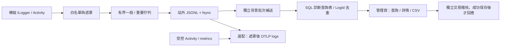

# 診斷日誌架構

- 業務模組只用 `ILogger`（`[LoggerMessage]`）、`Activity` 與既有稽核。白名單、遮罩、查證代碼、例外分類、佇列、檔案、SQL 匯入、查詢與清理集中在 `AiNexus.Platform/Diagnostics`，模組不依賴儲存目的地。
- 一份站外 JSONL 同時是輪替日誌與 SQL 補送 journal；背景批次匯入 `diagnostics.DiagnosticEvents`，以 `LogId` 去重。SQL 故障不會擋住檔案保存。
- 日誌寫入不加入業務交易。安全稽核（`audit.AuditEvents`）是另一套：與業務同交易、獨立保存政策、不經診斷採樣。
- 相關文件：[事件清單](LOG_EVENTS.md)、[錯誤回應與遮罩](ERROR_CONTRACT.md)、[設定與故障排除](../operations/DIAGNOSTICS.md)、[系統日誌頁](../features/SYSTEM_LOGS.md)。

## 為什麼自建 provider

Serilog 等 rolling file sink 沒有本案需要的 SQL 補送 checkpoint、多執行個體協調與特權讀取稽核。因此只用一個 MEL provider 與一份檔案，避免兩套保存結果不一致；選配匯出也不另開未遮罩的 logger。邊界只接受受控 metadata，不是可任意序列化的通用 sink。OpenTelemetry .NET 版本跟著 `Directory.Packages.props`。



SQL 匯入用新連線（`Enlist=false`、抑制 ambient transaction、有限逾時）、`SqlBulkCopy` 暫存表與獨立 commit；成功後才原子更新 byte cursor。commit 後程序退出而 cursor 未更新時，重送靠 `LogId` 去重。檔案 writer 與 SQL importer 各有背景迴圈。

## 事件與等級

每筆事件有隨機 `LogId`、UTC `At`、Level、Category、EventId／EventName、MessageTemplate、PropertiesJson、Service、Environment、Version、Instance（主機＋PID＋每次啟動的隨機值），其餘關聯欄位（IssueCode、TraceId、JobId、RunId、UserId、Route、StatusCode、DurationMs、ErrorCode、ExceptionType…）依事件加入。欄位上限寫在 `DiagnosticRedactor`；結構化屬性最多 32 個核准 scalar，journal 每筆最多 64 KiB（含 checksum）。

| 等級 | 用途 |
| --- | --- |
| Trace／Debug | 短期深度追查、演算法狀態；不記查詢、聊天或文件文字 |
| Information | 正常操作、request 完成、背景工作生命週期、預期拒絕與使用者取消 |
| Warning | 降級、重試、部分功能不可用、受控的前端回報 |
| Error／Critical | 作業失敗、啟動失敗或重大服務失效；不被一般採樣略過 |

有查證代碼的拒絕也不採樣；`http.rejected` 不受最低等級過濾。一般驗證失敗不是 Error，使用者取消不是故障。

## 訊息呈現與請求上下文

- 只存 MessageTemplate＋受控 PropertiesJson，讀取時由 `DiagnosticMessage` 展開。列表只代入摘要權限可見的欄位，其他顯示 `[omitted]`；不呼叫原始 `ILogger` formatter。
- HTTP 完成事件帶 ClientAddress、UserAgent、Protocol、Scheme、RequestOutcome、RequestAborted、ResponseStarted；耗時只量一次，取消合併在完成事件。
- ClientAddress 只取 `Connection.RemoteIpAddress`，不自行信任 `X-Forwarded-For`；有反向代理時由部署端設定信任網段。User-Agent 是不可信提示，限 240 字元並遮罩。不蒐集完整 header、Cookie、URL、query、body 或瀏覽器指紋。
- 成功的系統日誌查詢已有稽核，不再寫相同的 HTTP 完成事件；錯誤與取消照記。診斷內部的 DB／查詢／清理以 AsyncLocal 抑制，避免日誌迴圈。

## 保存與多執行個體

```text
<Diagnostics.Directory>\
├─ capacity.lock                       # 跨程序容量 gate
├─ <每次啟動的隨機 GUID>\
│  ├─ owner.lock                       # 活動 owner 的排他 lease
│  ├─ 20261007-00000001.jsonl           # UTC 日期／大小輪替
│  └─ 20261007-00000001.jsonl.cursor    # 已 SQL commit 的 byte offset
└─ <已退出的 GUID>\...                  # 由取得 owner lease 的 importer 補送
```

每個程序寫自己的 segment；活躍 owner 的檔案不會被接管，退出後由任一 importer 補送。不同主機各有本機目錄，SQL 以 `LogId` 去重。這處理了日誌的多實例與重疊回收，不改變聊天排程單一 worker 的限制。

| 狀況 | 行為 |
| --- | --- |
| 正常 | request 非阻塞 TryWrite；背景批次 fsync，再非同步匯入 SQL |
| 佇列滿 | 拒絕入列並計數；重要佇列有獨立容量，同樣不阻塞 request |
| SQL 離線／逾時 | 檔案照存、cursor 不前進、有限重試；恢復後依 `LogId` 補送 |
| 磁碟滿／無權限 | 保留待寫 batch 有限重試；佇列滿後遺失並計數 |
| checksum 不符／截斷 | 該筆計 Corrupt＋Lost 並寫緊急記錄，跳過繼續 |
| 正常 shutdown／回收 | 診斷 worker 最後停止，在 `ShutdownSeconds` 內補寫記憶體內容，不等 SQL 補送完 |
| 強制終止／斷電 | 已 fsync 的可重送；記憶體內與未寫完的 batch 可能遺失 |

緊急通道不用 `ILogger`、EF 或外部 sink：寫 stderr，來源已註冊時另寫 Windows Application `AiNexus.Diagnostics` event 9010（註冊方式見 [維運](../operations/DIAGNOSTICS.md#windows-緊急事件來源)）。

## OTLP（選配）

向 `/v1/logs`、`/v1/traces`、`/v1/metrics` 匯出。Traces 只有 AiNexus 自建的 spans，不開會帶 SQL／URL 的自動 instrumentation；metrics 另含框架內建 meters（清單在 `DiagnosticRegistration.Meters`），標籤都是低基數值。OTLP 沒有 durable outbox，collector 故障時不補送；本機補送只針對 SQL。

## 能力界線

SQL 表與本機檔案不是不可竄改：journal 的 SHA-256 只偵測意外損壞，有 NTFS／SQL 權限的人可改寫並重算。不宣稱 WORM、密碼學鏈或法規合規；需要時另設權限分離與外部不可改寫保存。
