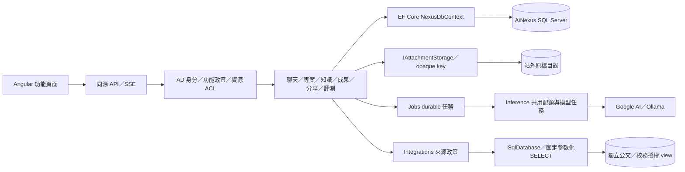

# 架構總覽

- ASP.NET Core 模組化單體＋Angular 功能路由，部署在單一 IIS 執行個體。
- 模組各自管理端點、實體與服務，共用一個 scoped `NexusDbContext`，跨模組異動在同一個交易完成。
- 不拆每模組一個專案、不引入 MediatR 或分層專案，原因見 [ADR 0002](../decisions/0002-vertical-slice-single-features-project.md)。
- 細節：[模組邊界](module-boundaries.md)、[後端撰寫慣例](backend-conventions.md)、[生成與背景任務](generation.md)、[資料庫](database.md)、[身分與授權](access-control.md)、[診斷日誌](diagnostics.md)。

## 三個專案

依賴方向固定為 Host → Features → Platform，由 `AiNexus.ArchitectureTests` 檢查。

| 專案 | 責任 |
| --- | --- |
| `AiNexus.Host` | 設定載入、middleware 管線、模組組裝（`Program.cs`）與維運子命令（`db init`、`verify …`） |
| `AiNexus.Features` | 業務模組，每個模組一個資料夾，以 `<Module>Module`（`IFeatureModule`）註冊服務、設定、授權政策、rate limit 與端點；`FeatureModules` 是唯一的模組清單。`Persistence` 放共用 context 與 migration |
| `AiNexus.Platform` | 不認識業務的共用基礎：錯誤與 `Result<T>`、安全、設定註冊、診斷、HTTP 限制、domain event 分派、手寫 SQL（`Data/Sql`）、程序內鎖 |

端點的 body 上限以 `WithRequestBodyLimit` 宣告在端點旁。模組間只用明確的 `public` 服務，不新增能繞過 owner、ACL 或模型核准的資料入口；「A 發生後 B 跟著處理」用同交易的 domain event（見 [模組邊界](module-boundaries.md#直接呼叫或-domain-event)）。

## 模組責任

| 模組 | 責任與邊界 |
| --- | --- |
| Identity | AD／Windows 與本地登入、SID 映射、cookie／CSRF、功能授權判斷 |
| AccessControl | 使用者→角色→群組→功能的有效授權、模型政策資料、server-side policy |
| Account | 登入者本人的資料、偏好、閱讀設定與個人用量 |
| Administration | 首次管理員 bootstrap、帳號與授權、群組模型與配額、用量與唯讀對話 |
| Conversations | 私人訊息樹與分支、標題、收藏／封存／標籤、搜尋、文字備份匯入 |
| Inference | provider、模型呈現與政策、聊天佇列、服務狀態（`/status`）、共用模型任務 |
| Chat | 組合對話、附件、專案、知識與網路搜尋：Context、執行與 SSE、重播事件清理，整段對話的讀取／匯出／複製／刪除 |
| Jobs | durable jobs、租約與 fenced checkpoint、任務查詢／取消／重試 |
| Audit | 活動稽核查詢與分類（寫入由各模組在同一交易加入 `AuditEvent`） |
| Diagnostics | 系統日誌查詢、詳情、匯出、健康資訊與前端錯誤回報 |
| Monitoring | 在線人員、工作階段、API／SQL／HTTP 負載的即時觀測 |
| Notifications | owner 範圍的 durable 通知與目標連結，與觸發事件同交易 |
| Attachments | 格式與大小驗證、原檔與文字、配額、下載授權與引用 |
| Library | 個人提示詞範本 |
| Collaboration | 私有資源、具名 viewer／editor、群組唯讀 ACL |
| Sharing | 具名收件人、版本快照、到期與撤銷 |
| Knowledge | 逐頁閱讀、OCR／索引、embedding、授權檢索、引用快照、檔案庫清單 |
| Artifacts | 不可變版本、樂觀衝突檢查、段落工具、Word／PDF |
| Projects | 共用指示、文件、範本與成果；提問仍屬個人 |
| Quality | 私人回饋、固定評測、設定快照、逐題結果與人工評分 |
| Integrations | 來源政策、固定授權 view、唯讀搜尋與歷程、明確匯入 |
| Billing | 追加價格版本、呼叫價格快照、實際用量計費、報表與 CSV；不以 Context 預估冒充帳單 |
| WebSearch | 搜尋 provider、本人配額與冪等紀錄、可核對來源；不爬取結果網站 |
| Repositories | 使用者 Gitea token、唯讀 repository／issue／檔案、固定 commit 匯入、背景程式碼 review |
| Dashboard | 組合已授權的資源、任務與費用統計；平台範圍另驗 admin |

## 三種權限

1. **平台功能**：每個 request 由 SQL 計算有效的角色、群組與功能；UI 導覽只是呈現，撤銷影響下一次操作。
2. **平台資料**：私人對話驗 owner；專案、知識、成果、評測驗資源 ACL，子文件與成果繼承專案 ACL。具名分享另存快照、收件人與期限。
3. **來源資料**：公文／校務先驗功能與允許來源的群組，再以登入者 SID／帳號查來源的授權 view；平台管理員不自動取得外部資料權限。

擁有者與具名 editor 可寫，群組只授予閱讀；專案成員看不到彼此的私人對話；分享不是匿名連結，也不是原資源的 editor 權限。詳見 [身分與授權](access-control.md)、[專案](../features/projects.md)、[分享](../features/sharing.md)、[資料來源](../features/integrations.md)。

## 資料層

EF Core 負責 mapping、migration、關聯與跨模組交易。EF 表達不了的 SQL（全文、原生向量、伺服器狀態）用 `ISqlDatabase<NexusDbContext>`，走同一條連線並加入目前的交易；來源 adapter 只用固定 SQL 與參數。原檔不進資料庫，由 `IAttachmentStorage` 存在站外目錄。

## 新增功能

建立模組資料夾與 `<Module>Module.cs`、實體與組態、授權規則（需要時宣告 `FeatureSeed`）、migration、前端 lazy route，再重產 OpenAPI 與前端型別並補邊界測試。不是每個操作都要新的授權功能，工具可沿用所屬功能的政策。新增模組與授權的步驟見 [身分與授權](access-control.md#擴充功能)。
